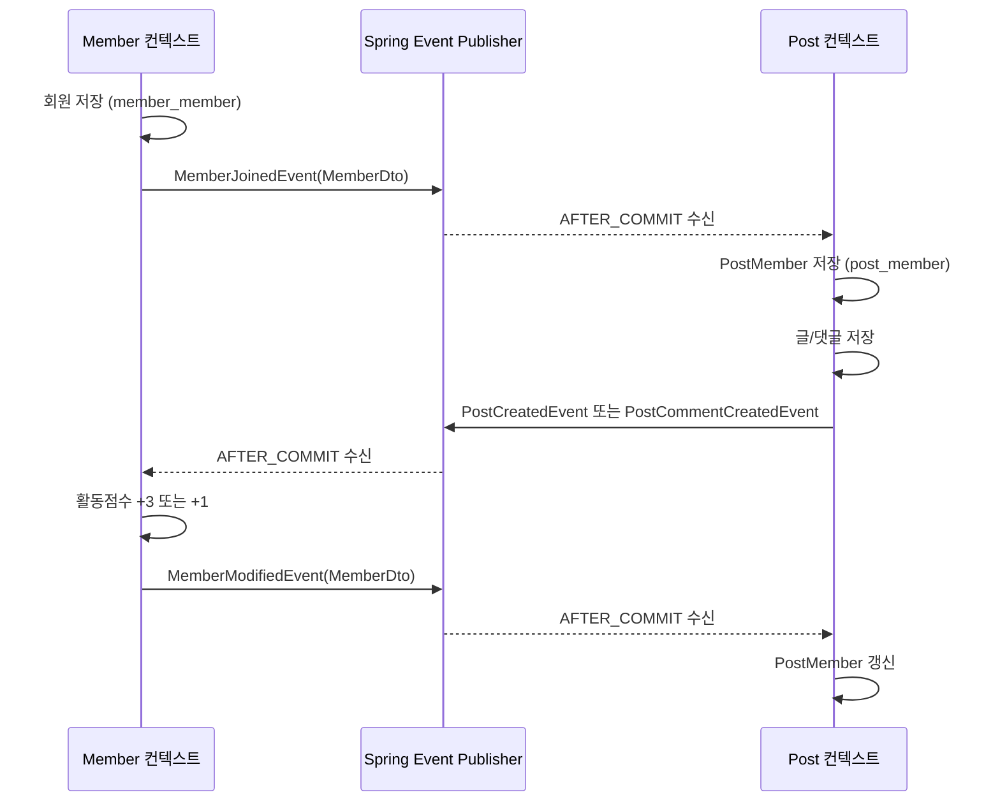

# MSA Project

회원(Member)과 게시글(Post)을 논리적으로 분리하고, 회원 정보를 게시글 컨텍스트에 복제해 사용하는 Spring Boot 예제입니다. 회원 활동(글·댓글 작성)에 따라 활동점수를 계산하고, 이벤트로 회원 복제본을 동기화합니다.
이 프로젝트의 컨텍스트 분리는 하나의 Spring Boot 애플리케이션 안에서 패키지와 이벤트로 구현되어 있습니다. 

## 기술 및 실행 환경

| 항목 | 버전 / 설정 |
| --- | --- |
| Java | JDK 21 (`build.gradle.kts` toolchain) |
| Gradle | Wrapper 9.7.1 |
| Spring Boot | 4.1.1 |
| Database | PostgreSQL 17 (Docker Compose) |
| 애플리케이션 포트 | `8080` |
| PostgreSQL 호스트 포트 | `5433` |

## DB 설정

`compose.yaml`과 `src/main/resources/application.yaml`의 기본 개발 환경 설정은 다음과 같습니다.

```yaml
# compose.yaml
POSTGRES_DB: msa_project
POSTGRES_USER: msa_user
POSTGRES_PASSWORD: 1234
ports:
  - "5433:5432"
```

```yaml
# application.yaml
spring:
  datasource:
    url: jdbc:postgresql://localhost:5433/msa_project
    username: msa_user
    password: 1234
  jpa:
    hibernate:
      ddl-auto: update
    show-sql: true
```

위 계정과 비밀번호는 로컬 개발 전용입니다. 운영 환경에서는 환경 변수나 시크릿으로 분리필요

## 실행

```bash
# 1. PostgreSQL 실행
docker compose up -d

# 2. 컴파일 및 테스트
./gradlew clean build

# 3. 애플리케이션 실행
./gradlew bootRun
```

중지할 때는 다음을 사용합니다.

```bash
docker compose down
```

DB 데이터까지 초기화하려면 명시적으로 볼륨을 함께 제거합니다. 이 명령은 데이터를 삭제합니다.

```bash
docker compose down -v
```

## 논리 모듈 구성

| 영역 | 책임 | 주요 구성 |
| --- | --- | --- |
| `boundedContext.member` | 회원 원본 저장, 가입, 활동점수 정책 | `Member`, `MemberFacade`, `MemberJoinUseCase`, `MemberEventListener` |
| `boundedContext.post` | 게시글·댓글 저장, 회원 복제본 사용 | `Post`, `PostComment`, `PostMember`, `PostFacade`, `PostWriteUseCase`, `PostEventListener` |
| `shared.member` | 두 컨텍스트가 공유하는 회원 DTO·이벤트·복제 기반 클래스 | `MemberDto`, `MemberJoinedEvent`, `MemberModifiedEvent`, `ReplicaMember` |
| `shared.post` | 게시글/댓글 이벤트 페이로드 | `PostDto`, `PostCommentDto`, `PostCreatedEvent`, `PostCommentCreatedEvent` |
| `global` | 이벤트 발행, JPA 기반 엔티티, 공통 응답 | `EventPublisher`, `BaseEntity`, `BaseIdAndTime`, `RsData` |

데이터는 아래 테이블에 저장됩니다.

| 컨텍스트 | 원본 / 복제 | 테이블 |
| --- | --- | --- |
| Member | 회원 원본 | `member_member` |
| Post | 회원 복제본 | `post_member` |
| Post | 게시글 | `post_post` |
| Post | 댓글 | `post_post_comment` |

## 이벤트와 HTTP API를 구분한 이유

### 이벤트: 상태 변경을 다른 컨텍스트에 전달

회원 가입·회원 변경·글 작성·댓글 작성은 상태 변경 사건입니다. 발행한 트랜잭션이 성공적으로 커밋된 뒤(`@TransactionalEventListener(phase = AFTER_COMMIT)`) 처리하고, 수신 처리는 `REQUIRES_NEW` 트랜잭션으로 분리합니다.

| 이벤트 | 발행 시점 | 수신 처리 |
| --- | --- | --- |
| `MemberJoinedEvent` | 회원 가입 후 | Post 컨텍스트에 `PostMember` 생성 |
| `MemberModifiedEvent` | 활동점수 변경 후 | Post 컨텍스트의 `PostMember` 갱신 |
| `PostCreatedEvent` | 글 저장 후 | Member 원본의 활동점수 `+3` |
| `PostCommentCreatedEvent` | 댓글 추가 후 | Member 원본의 활동점수 `+1` |

이 방식은 Post가 Member의 저장소를 직접 갱신하지 않게 하며, 각 컨텍스트가 자신의 데이터를 소유하게 합니다. 반면 이벤트 기반 복제는 즉시 일관성이 아니라 **커밋 이후의 최종 일관성**을 전제로 합니다.

### HTTP API: 요청 시 즉시 필요한 조회 값 획득

글 작성 응답에는 보안 팁을 바로 포함해야 합니다. 따라서 `PostWriteUseCase`의 `MemberApiClient`가 `RestClient`로 Member API를 동기 호출합니다.

```text
PostWriteUseCase
  └─ GET /api/v1/member/members/randomSecureTip
       └─ MemberFacade.getRandomSecureTip()
```

이 값은 저장 상태를 복제하는 것이 아니라 현재 요청의 응답을 만들기 위한 값이므로 이벤트보다 HTTP 요청/응답 모델이 더 적합합니다. 단, 현재 코드에서는 같은 애플리케이션의 `localhost:8080`을 호출하므로 서버가 정상 기동 중이어야 합니다.

## 회원 복제 흐름



`PostMember`는 원본 `Member`의 ID를 그대로 사용합니다. 글과 댓글은 `PostMember`를 참조하므로 Post 컨텍스트는 회원 원본 테이블을 조인하지 않고 작성자 정보를 조회할 수 있습니다.

## HTTP API

| Method | URL | 설명 | 성공 응답 |
| --- | --- | --- | --- |
| `GET` | `/api/v1/member/members/randomSecureTip` | 비밀번호 변경 권장 주기 조회 | `200 text/plain` |

요청과 실제 응답 예시는 다음과 같습니다.

```bash
curl --include http://localhost:8080/api/v1/member/members/randomSecureTip
```

```http
HTTP/1.1 200
Content-Type: text/plain;charset=UTF-8

비밀번호의 유효기간은 90일 입니다.
```

## 초기 데이터

애플리케이션 시작 시 `ApplicationRunner`가 다음 데이터를 준비합니다.

| 항목 | 개수 | 내용 |
| --- | ---: | --- |
| 회원 | 6 | `system`, `holding`, `admin`, `user1`, `user2`, `user3` |
| 회원 복제본 | 6 | 회원 가입 이벤트로 생성 |
| 게시글 | 6 | user1 3개, user2 2개, user3 1개 |
| 댓글 | 8 | user1 2개, user2 3개, user3 3개 |

## 검증 결과

아래 결과는 2026-09-26에 PostgreSQL 17과 JDK 21 환경에서 확인했습니다.

### 1. 초기 데이터 개수 및 재실행 시 중복 여부

```sql
SELECT 'member_member' AS table_name, COUNT(*) AS count FROM member_member
UNION ALL SELECT 'post_member', COUNT(*) FROM post_member
UNION ALL SELECT 'post_post', COUNT(*) FROM post_post
UNION ALL SELECT 'post_post_comment', COUNT(*) FROM post_post_comment;
```

첫 기동 후와 재실행 후 모두 같은 결과였습니다.

```text
    table_name     | count
-------------------+-------
 member_member     |     6
 post_member       |     6
 post_post         |     6
 post_post_comment |     8
```

### 2. 회원별 글·댓글 수와 활동점수

활동점수 규칙은 **글 1개당 +3점**, **댓글 1개당 +1점**입니다.

```sql
SELECT
  m.id,
  m.username,
  (SELECT COUNT(*) FROM post_post p WHERE p.author_id = m.id) AS post_count,
  (SELECT COUNT(*) FROM post_post_comment c WHERE c.author_id = m.id) AS comment_count,
  m.activity_score,
  (SELECT COUNT(*) FROM post_post p WHERE p.author_id = m.id) * 3
    + (SELECT COUNT(*) FROM post_post_comment c WHERE c.author_id = m.id) AS expected_score,
  m.activity_score = (
    (SELECT COUNT(*) FROM post_post p WHERE p.author_id = m.id) * 3
    + (SELECT COUNT(*) FROM post_post_comment c WHERE c.author_id = m.id)
  ) AS score_matches
FROM member_member m
ORDER BY m.id;
```

| 회원 | 글 수 | 댓글 수 | 활동점수 | 기대값 | 검증 |
| --- | ---: | ---: | ---: | ---: | --- |
| system | 0 | 0 | 0 | 0 | PASS |
| holding | 0 | 0 | 0 | 0 | PASS |
| admin | 0 | 0 | 0 | 0 | PASS |
| user1 | 3 | 2 | 11 | 11 | PASS |
| user2 | 2 | 3 | 9 | 9 | PASS |
| user3 | 1 | 3 | 6 | 6 | PASS |

### 3. 원본과 회원 복제본 일치 여부

다음 SQL로 원본과 Post 컨텍스트의 복제본을 비교했습니다.

```sql
SELECT
  m.id,
  m.username,
  m.activity_score AS source_score,
  pm.activity_score AS replica_score,
  m.create_date = pm.create_date AS create_date_matches,
  m.modify_date = pm.modify_date AS modify_date_matches,
  (m.username, m.nickname, m.activity_score)
    IS NOT DISTINCT FROM (pm.username, pm.nickname, pm.activity_score) AS member_data_matches
FROM member_member m
JOIN post_member pm ON pm.id = m.id
ORDER BY m.id;
```

가입 시 복제한 ID·username·nickname·활동점수·생성 시각은 모두 일치합니다. 활동점수 변경 이벤트도 같은 ID의 기존 행을 `UPDATE`하여 반영하며, 행 수는 6개로 유지됩니다.

| 회원 | 원본 점수 | 복제본 점수 | 회원 데이터 | 생성 시각 |
| --- | ---: | ---: | --- | --- |
| system | 0 | 0 | PASS | PASS |
| holding | 0 | 0 | PASS | PASS |
| admin | 0 | 0 | PASS | PASS |
| user1 | 11 | 11 | PASS | PASS |
| user2 | 9 | 9 | PASS | PASS |
| user3 | 6 | 6 | PASS | PASS |

### 4. SQL 및 애플리케이션 로그 확인 방법

`application.yaml`에는 다음 설정이 포함되어 있으므로 실행 콘솔에서 Hibernate SQL과 바인딩 값을 볼 수 있습니다.

```yaml
spring:
  jpa:
    show-sql: true
logging:
  level:
    org.hibernate.orm.jdbc.bind: TRACE
    org.hibernate.orm.jdbc.extract: TRACE
    org.springframework.transaction.interceptor: TRACE
```

PostMember 복제본을 조회할 때도 다음 SQL과 결과가 출력됩니다.

```text
select pm1_0.id, pm1_0.activity_score, pm1_0.username
from post_member pm1_0
where pm1_0.username=?

binding parameter (1:VARCHAR) <- [user1]
extracted value (2:INTEGER) -> [11]
```

마지막 로그의 `11`은 원본 user1의 활동점수와 같으며, 활동점수 복제 갱신이 성공했음을 보여 줍니다.

### 5. 보안 팁 HTTP 호출 결과

Post 모듈이 글 작성 응답을 만들 때 사용하는 Member API를 직접 호출해 확인했습니다.

```bash
curl --silent --show-error --include \
  http://localhost:8080/api/v1/member/members/randomSecureTip
```

```http
HTTP/1.1 200
Content-Type: text/plain;charset=UTF-8
Content-Length: 48

비밀번호의 유효기간은 90일 입니다.
```
